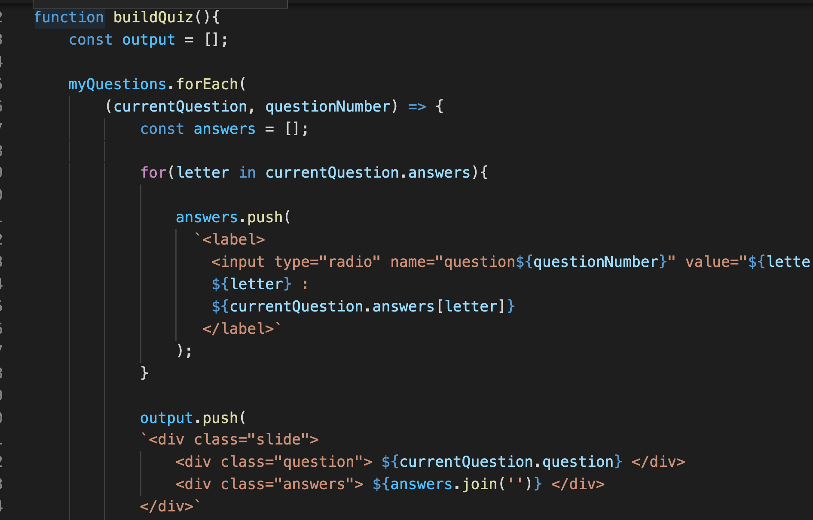
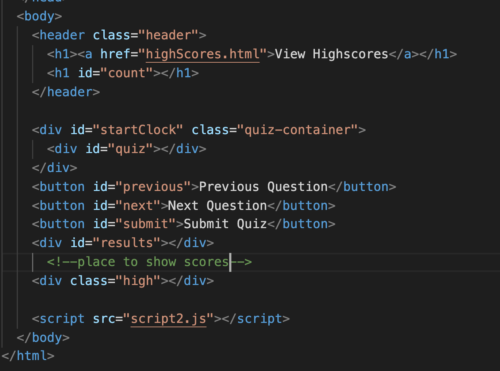
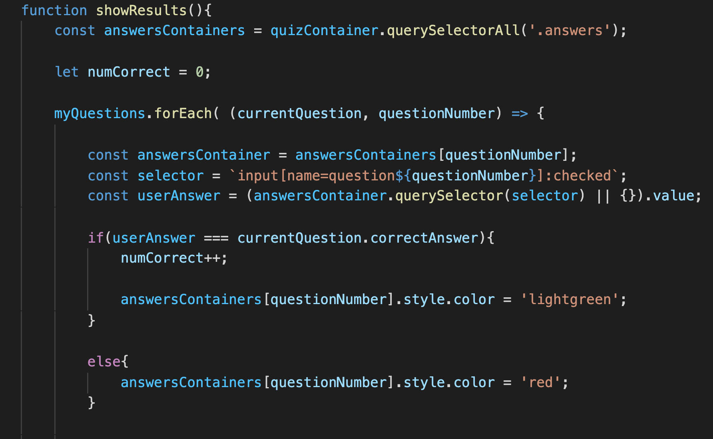
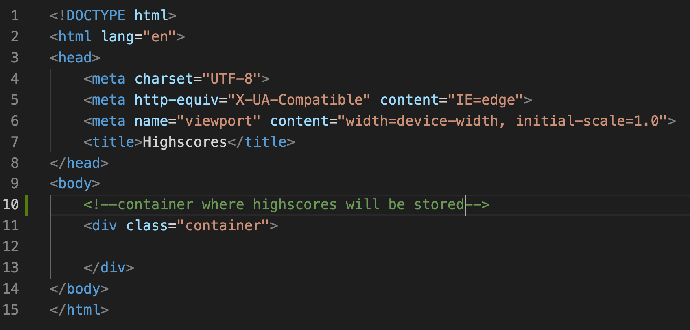
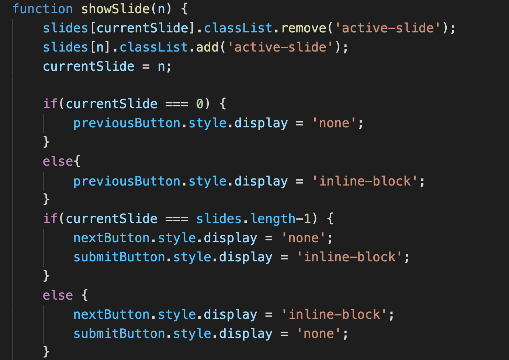
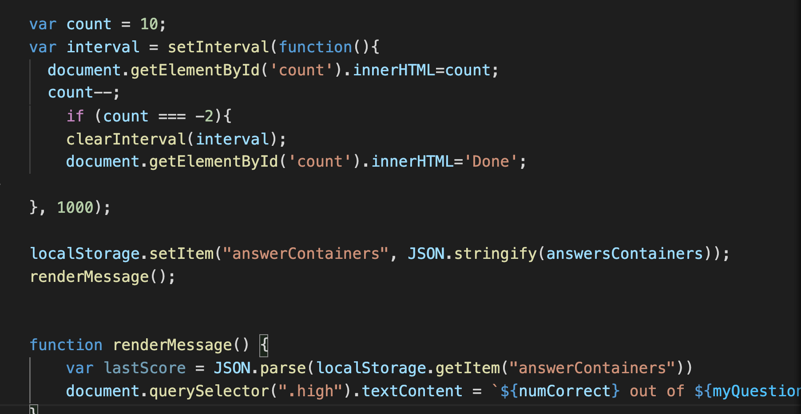

# Code-Quiz-04

## Discribtion
  The objective of this project was to create a javaScript quiz with a countdown timer, questions that appear when answered, time subtracted when the answer is incorect, game over when timer reaches 0 and you can save your score. 
  
## Usage

* this function creates the quiz

* the html that has id's and class's for the quiz and buttons 

* creates the functions for the next and previous arrows

* creates functions for the results to show at the bottom of the screen

* where the score would have gone

*creates slide show function

*creates timer 

## Conclusion
 This project had its ups and downs, I'm having trouble connecting the coundown timer to the start of the game and also running into problems with saving results into local storage. 
